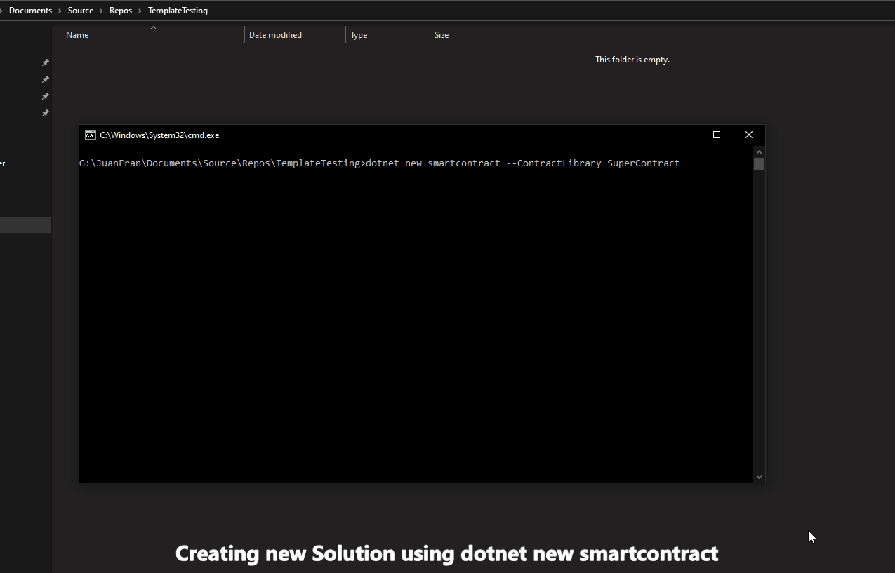

# Nethereum Templates Smart Contract Default C# Library
Template to create a smart contract library development solution including:
* Smart contract example (ERC20)
* Auto code generation settings for vscode
* XUnit testing and testchains setup for Geth, Ganache, CustomUrl, etc
* Examples of integration testing the smart contract ERC20 (Token transfer, balance, deployment, Events and Log Processing)
* Examples of integration testing Ether transfers



## Integration testing configuration 
Integration testing can be configured to use different clients, see the Appsettings.test.json.

The current Client can be set to Geth, Ganache, Infura, External, Hardhat

When running Geth for integration testing locally (default), this is located in the ```testchain``` folder ```gethclique```. The windows executable it is already included for you.
If you want to update the version of geth or if you are using another OS just download the latest from https://geth.ethereum.org/downloads/ and set the correct path in EthereumTestSettings.

If you want to use a local node or custom url for integration testing, just use the External setting, and provide the HttpUrl.

Appsettings.test.json has a comments section describing each of the possible settings:

```json
{
  "EthereumTestSettings": {
    "GethPath": "..\\..\\..\\..\\testchain\\gethclique\\geth.exe",
    "AccountAddress": "0x12890d2cce102216644c59daE5baed380d84830c",
    "AccountPrivateKey": "0xb5b1870957d373ef0eeffecc6e4812c0fd08f554b37b233526acc331bf1544f7",
    "ManagedAccountPassword": "password",
    "ChainId": "444444444500",
    "Client": "Geth",
    "InfuraNetwork": "Rinkeby",
    "InfuraId": "INPUT INFURA ID HERE",
    "HttpUrl": "http://localhost:8545"
  },

  "Comments": {
    "GetPath": "This is the path to your geth executable , this is already set to your testchain path, with the preconfigured genesis, if you work on linux, mac download the right executable, and in windows to updated",
    "AccountAddress": "The account address of your private key",
    "AccountPrivateKey": "The private key to sign your transactions , preconfigured to the genesis test account used by Nethereum preconfigured testchain",
    "ManagedAccountPassword": "If you want to work with managed accounts , by the client, the password for your web3 storage",
    "ChainId": "The chainId of the node to connect",
    "Client": "Geth , Ganache, Infura, External, HardHat.. The client to connect to, if External it will use the HttpUrl",
    "InfuraNetwork": "The Infura network to connect to",
    "InfuraId": "The InfuraId to connect to",
    "HttpUrl":  "The external http url to connect to , i.e http://localhost:8545 or other testchains etc"
  }
}

```

## Installation locally

* Clone repo
* Run ```dotnet new -i .\``` in the command line / terminal
* Run ```dotnet new smartcontract --ContractName "YourContractName"```
 
